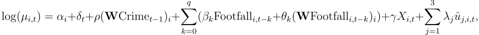

# ambient-population-crime-causal
This repository contains all the code used for the paper "Ambient Populatio and Crime: The Fragility of Causal Links in Urban Environments" by Ariadna Albors Zumel, Michele Tizzoni, Wilson Hernández, and Gian Maria Campedelli.

📄 You can find the full paper here:

## Introduction
The relationship between ambient population and crime has long been studied, with foundational theories offering competing mechanisms: increased pedestrian activity may enhance guardianship and informal surveillance, but also generate opportunities by increasing suitable targets. Yet, nearly all empirical evidence remains correlational, despite causal identification being essential for policy. We causally address this link using high-resolution smartphone-derived footfall data from Baltimore, Chicago, and Philadelphia (June 2023–June 2025), estimating a pipeline of increasingly rigorous models—from naïve baselines to fully instrumented two-stage residual inclusion specifications with distributed lags, two-way fixed effects, and spatial spillovers. The results are sobering: associations between ambient population and crime progressively vanish as endogeneity is addressed, and none survive correction for multiple testing. The few effects that do emerge are sensitive to crime type, temporal granularity, and neighborhood context. Our findings caution against universal claims linking foot traffic to crime and call for locally tailored, causally informed policy design.

## Code structure

### Preprocessing
- crime_data:
  1. Download the data for each city ([Baltimore](https://data.baltimorecity.gov/datasets/baltimore::nibrs-group-a-crime-data/about), [Chicago](https://data.cityofchicago.org/Public-Safety/Crimes-2001-to-Present/ijzp-q8t2/about_data), and [Philadelphia](https://opendataphilly.org/datasets/crime-incidents/)) and put in the folder structure "raw_data/<city_name>".
  2. `1-generate_raw_datasets.py`:
  3. `2-generate_selected_crimes_datasets.py`:
  4. `3-generate_crimes_per_hex_dataset.py`:
- mobility_data:
  1. `0-download_data.py`:
  2. `1-preprocess_mobility_data.py`:
  3. `2-get_mobility-data_per_hex.py`:
- confounders_and_moderators_datasets:
  - `Holidays_<city>.csv`:
  - `<city>_sport_events.csv`:
  - `<city>_extra_events.csv`:
  - `<city>_mobility_hex.csv`:
  - `<city>_sociodem_hex.csv`:

### Models
- baseline:
- model_2:
- model_3:
- model_4:
- model_5:

## Structure of the final causal model using 2SRI (Model 5)
Our causal model is a 2SRI model with fixed effects, covariates, distributed lags, and spillover effects using a modified spatial Durbin term:

where $\alpha_i$ is the hexagon fixed effects, $\delta_t$ represents the time fixed effects, $\rho$ is the spatial autoregressive coefficient that measures how strongly neighboring hexagons' past expected log crime counts influence hexagon $i$'s own expected log crime count, the parameter $\mathbf{W}\in \\{0,1\\}^{n\times n}$ is the spatial weights matrix, where $n$ is the total number of hexagons, the coefficient $\beta_0$ is interpreted as the immediate effect of footfall in hexagon $i$ on the log of the expected crime count, the sum $\sum_{k=0}^q\beta_k$ represents the long-run cumulative effect of footfall in hexagon $i$ on the log of the expected crime count, the coefficients $\theta_k$ measure the impact of neighboring footfall on the current hexagon's expected log crime count at lag $k$, the term $\gamma X_{i,t}$ is the time-varying covariates not captured by the fixed effects, and $\hat{u}_{j,i,t}$ are the residuals for the three endogenous variables incorporated as part of the 2SRI model in order to correct for endogeneity.
